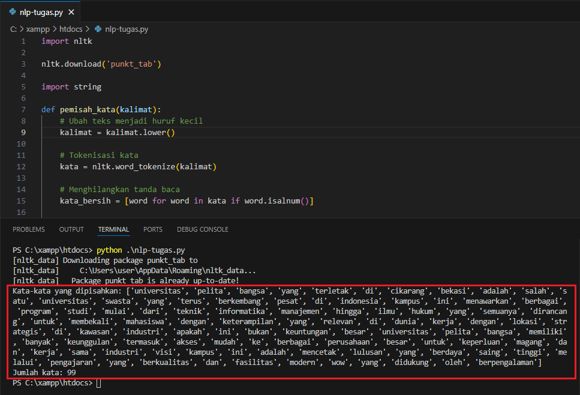

# Natural Language Processing (NLP)

Natural Language Processing (NLP) adalah cabang dari kecerdasan buatan (AI) yang berfokus pada interaksi antara komputer dan bahasa manusia (natural language). Tujuan utama NLP adalah memungkinkan komputer untuk memahami, memproses, dan menghasilkan bahasa manusia dengan cara yang bermanfaat.

# Tugas 1 - Word Tokenize

``` py
    import nltk

    nltk.download('punkt_tab')

    import string

    def pemisah_kata(kalimat):
        # Ubah teks menjadi huruf kecil
        kalimat = kalimat.lower()

        # Tokenisasi kata
        kata = nltk.word_tokenize(kalimat)
        
        # Menghilangkan tanda baca
        kata_bersih = [word for word in kata if word.isalnum()] 
        
        # Menghitung jumlah kata
        jumlah_kata = len(kata_bersih)
        
        return kata_bersih, jumlah_kata

    # Contoh kalimat
    kalimat = "Universitas Pelita Bangsa, yang terletak di Cikarang, Bekasi, adalah salah satu universitas swasta yang terus berkembang pesat di Indonesia! Kampus ini menawarkan berbagai program studi, mulai dari Teknik Informatika, Manajemen, hingga Ilmu Hukum, yang semuanya dirancang untuk membekali mahasiswa dengan keterampilan yang relevan di dunia kerja. Dengan lokasi strategis di kawasan industri (apakah ini bukan keuntungan besar?), Universitas Pelita Bangsa memiliki banyak keunggulan, termasuk akses mudah ke berbagai perusahaan besar untuk keperluan magang dan kerja sama industri! Visi kampus ini adalah mencetak lulusan yang berdaya saing tinggi melalui pengajaran yang berkualitas dan fasilitas modern (wow!), yang didukung oleh dosen-dosen berpengalaman."

    kata_bersih, jumlah_kata = pemisah_kata(kalimat)

    print("Kata-kata yang dipisahkan:", kata_bersih)
    print("Jumlah kata:", jumlah_kata)
```

## Penjelasan Kode

1. `import nltk`
   Kode ini mengimpor modul NLTK (Natural Language Toolkit), yang merupakan pustaka Python untuk pemrosesan bahasa alami (NLP). Modul ini menyediakan berbagai alat seperti tokenisasi, stemming, dan lainnya yang berguna untuk analisis teks.

2. `nltk.download('punkt_tab')`
   Bagian ini digunakan untuk mendownload dataset Punkt, yang merupakan salah satu tokenizer berbasis statistik yang dibutuhkan untuk melakukan tokenisasi kalimat dan kata di bahasa tertentu.

3. `import string`
   Untuk mengimpor modul string dari pustaka standar Python. Modul ini menyediakan beberapa fungsi dan konstanta yang berhubungan dengan manipulasi teks, seperti daftar semua huruf alfabet dan tanda baca.

4. `def pemisah_kata(kalimat):`
   Merupakan definisi fungsi bernama `pemisah_kata` yang menerima satu parameter yaitu kalimat. Fungsi ini akan memproses kalimat untuk menghasilkan daftar kata bersih dan menghitung jumlah kata.

5. `kalimat = kalimat.lower()`
   Kode ini mengubah seluruh kalimat menjadi huruf kecil agar kata-kata dapat di-tokenisasi dengan lebih konsisten (misalnya, "Universitas" dan "universitas" dianggap sama).

6. `kata = nltk.word_tokenize(kalimat)`
   Kode ini melakukan tokenisasi kata menggunakan fungsi `word_tokenize()` dari NLTK, yang memecah kalimat menjadi unit-unit kata individu (berdasarkan spasi dan tanda baca).

7. `kata_bersih = [word for word in kata if word.isalnum()]`
   Merupakan list comprehension yang berfungsi untuk membuat daftar baru `kata_bersih`, yang berisi hanya kata-kata yang merupakan alphanumeric (mengandung huruf atau angka saja). Metode `isalnum()` digunakan untuk memeriksa apakah karakter dalam string adalah alphanumeric (tanpa tanda baca).
   
8. `jumlah_kata = len(kata_bersih)`
   Untuk menghitung jumlah kata yang tersisa setelah menghilangkan tanda baca dengan menggunakan fungsi `len()` untuk menghitung panjang dari daftar `kata_bersih`.

## Hasil

